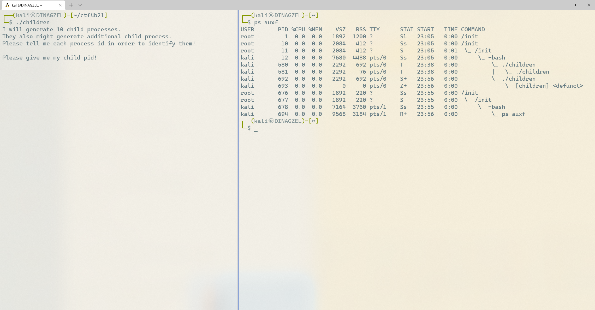
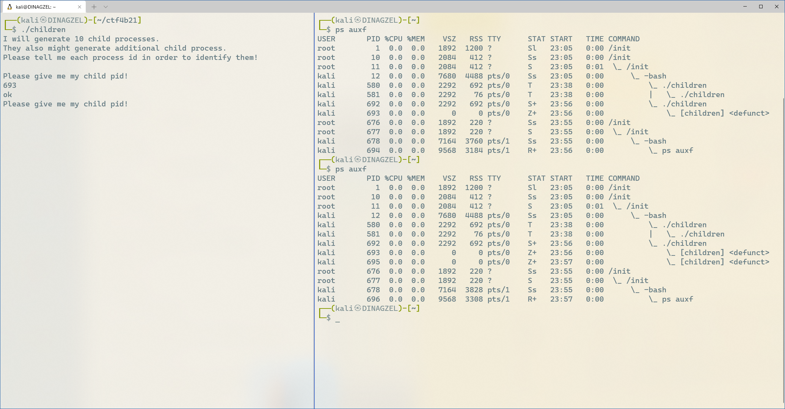

# SECCON Beginners 2021 Reversing

## only_read
```
[0x000010a0]> pdf @main
            ; DATA XREF from entry0 @ 0x10c1
┌ 352: int main (int argc, char **argv, char **envp);

~~~~~~~~~~~~~~~~~~~~~~~~~~~~~~~~~~~

│           0x000011db      c64405e000     mov byte [rbp + rax - 0x20], 0
│           0x000011e0      0fb645e0       movzx eax, byte [buf]
│           0x000011e4      3c63           cmp al, 0x63
│       ┌─< 0x000011e6      0f85da000000   jne 0x12c6
│       │   0x000011ec      0fb645e1       movzx eax, byte [var_1fh]
│       │   0x000011f0      3c74           cmp al, 0x74
│      ┌──< 0x000011f2      0f85ce000000   jne 0x12c6
│      ││   0x000011f8      0fb645e2       movzx eax, byte [var_1eh]
│      ││   0x000011fc      3c66           cmp al, 0x66
│     ┌───< 0x000011fe      0f85c2000000   jne 0x12c6
│     │││   0x00001204      0fb645e3       movzx eax, byte [var_1dh]
│     │││   0x00001208      3c34           cmp al, 0x34
│    ┌────< 0x0000120a      0f85b6000000   jne 0x12c6
│    ││││   0x00001210      0fb645e4       movzx eax, byte [var_1ch]
│    ││││   0x00001214      3c62           cmp al, 0x62
│   ┌─────< 0x00001216      0f85aa000000   jne 0x12c6
│   │││││   0x0000121c      0fb645e5       movzx eax, byte [var_1bh]
│   │││││   0x00001220      3c7b           cmp al, 0x7b
│  ┌──────< 0x00001222      0f859e000000   jne 0x12c6
│  ││││││   0x00001228      0fb645e6       movzx eax, byte [var_1ah]
│  ││││││   0x0000122c      3c63           cmp al, 0x63
│ ┌───────< 0x0000122e      0f8592000000   jne 0x12c6
│ │││││││   0x00001234      0fb645e7       movzx eax, byte [var_19h]
│ │││││││   0x00001238      3c30           cmp al, 0x30
│ ────────< 0x0000123a      0f8586000000   jne 0x12c6
│ │││││││   0x00001240      0fb645e8       movzx eax, byte [var_18h]
│ │││││││   0x00001244      3c6e           cmp al, 0x6e
│ ────────< 0x00001246      757e           jne 0x12c6
│ │││││││   0x00001248      0fb645e9       movzx eax, byte [var_17h]
│ │││││││   0x0000124c      3c35           cmp al, 0x35
│ ────────< 0x0000124e      7576           jne 0x12c6
│ │││││││   0x00001250      0fb645ea       movzx eax, byte [var_16h]
│ │││││││   0x00001254      3c74           cmp al, 0x74
│ ────────< 0x00001256      756e           jne 0x12c6
│ │││││││   0x00001258      0fb645eb       movzx eax, byte [var_15h]
│ │││││││   0x0000125c      3c34           cmp al, 0x34
│ ────────< 0x0000125e      7566           jne 0x12c6
│ │││││││   0x00001260      0fb645ec       movzx eax, byte [var_14h]
│ │││││││   0x00001264      3c6e           cmp al, 0x6e
│ ────────< 0x00001266      755e           jne 0x12c6
│ │││││││   0x00001268      0fb645ed       movzx eax, byte [var_13h]
│ │││││││   0x0000126c      3c74           cmp al, 0x74
│ ────────< 0x0000126e      7556           jne 0x12c6
│ │││││││   0x00001270      0fb645ee       movzx eax, byte [var_12h]
│ │││││││   0x00001274      3c5f           cmp al, 0x5f
│ ────────< 0x00001276      754e           jne 0x12c6
│ │││││││   0x00001278      0fb645ef       movzx eax, byte [var_11h]
│ │││││││   0x0000127c      3c66           cmp al, 0x66
│ ────────< 0x0000127e      7546           jne 0x12c6
│ │││││││   0x00001280      0fb645f0       movzx eax, byte [var_10h]
│ │││││││   0x00001284      3c30           cmp al, 0x30
│ ────────< 0x00001286      753e           jne 0x12c6
│ │││││││   0x00001288      0fb645f1       movzx eax, byte [var_fh]
│ │││││││   0x0000128c      3c6c           cmp al, 0x6c
│ ────────< 0x0000128e      7536           jne 0x12c6
│ │││││││   0x00001290      0fb645f2       movzx eax, byte [var_eh]
│ │││││││   0x00001294      3c64           cmp al, 0x64
│ ────────< 0x00001296      752e           jne 0x12c6
│ │││││││   0x00001298      0fb645f3       movzx eax, byte [var_dh]
│ │││││││   0x0000129c      3c31           cmp al, 0x31
│ ────────< 0x0000129e      7526           jne 0x12c6
│ │││││││   0x000012a0      0fb645f4       movzx eax, byte [var_ch]
│ │││││││   0x000012a4      3c6e           cmp al, 0x6e
│ ────────< 0x000012a6      751e           jne 0x12c6
│ │││││││   0x000012a8      0fb645f5       movzx eax, byte [var_bh]
│ │││││││   0x000012ac      3c67           cmp al, 0x67
│ ────────< 0x000012ae      7516           jne 0x12c6
│ │││││││   0x000012b0      0fb645f6       movzx eax, byte [var_ah]
│ │││││││   0x000012b4      3c7d           cmp al, 0x7d
│ ────────< 0x000012b6      750e           jne 0x12c6
│ │││││││   0x000012b8      488d3d450d00.  lea rdi, str.Correct        ; 0x2004 ; "Correct" ; const char *s
│ │││││││   0x000012bf      e8acfdffff     call sym.imp.puts           ; int puts(const char *s)
│ ────────< 0x000012c4      eb0c           jmp 0x12d2
│ │││││││   ; XREFS(23)
│ └└└└└└└─> 0x000012c6      488d3d3f0d00.  lea rdi, str.Incorrect      ; 0x200c ; "Incorrect" ; const char *s
│           0x000012cd      e89efdffff     call sym.imp.puts           ; int puts(const char *s)
│           ; CODE XREF from main @ 0x12c4
│ ────────> 0x000012d2      90             nop
│           0x000012d3      488b45f8       mov rax, qword [canary]
│           0x000012d7      64482b042528.  sub rax, qword fs:[0x28]
│       ┌─< 0x000012e0      7405           je 0x12e7
│       │   0x000012e2      e899fdffff     call sym.imp.__stack_chk_fail ; void __stack_chk_fail(void)
│       │   ; CODE XREF from main @ 0x12e0
│       └─> 0x000012e7      c9             leave
└           0x000012e8      c3             ret
[0x000010a0]>
```

入力した文字列を，
```asm
cmp al, <文字のASCIIコード> 
```
といった感じで1つ1つFLAGの文字列と照らし合わしている。

つまり単にcmpしてる所を読めばよい。

**ctf4b{c0n5t4nt_f0ld1ng}**

## children

子プロセスを10個生成するので、それらのpidをすべて正しく答えていく。

---

- **ps コマンド**でプロセスの状態を監視する。"ps aux"がメジャーEE
  - a: 端末操作以外のプロセス表示
  - u: CPU, メモリの使用率も表示
  - x: 現在実行しているプロセスを表示
- 今回はそれらに加え、プロセスツリー表示のオプション"f"も加えて子プロセスをわかりやすくする。
  - ```ps auxf```

---

端末を2つ用意し、片方でchildrenを、もう片方でpsを実行。



ps側で、./childrenプロセスが子プロセス([children])を生成していることを確認できる。

そこで、子プロセスのpid(ここでは693)を回答。



次の子プロセスpidを求められるので、もう一度ps auxfを実行し、新たな子プロセスのpidを回答(ここでは695)。

以降、この繰り返しで10個すべてこたえきる。


## please_not_trace_me
- ptraceシステムコールによってgdbを起動できなくなっている。
> ptraceとはプロセス追跡をするシステムコールである。1回目の呼び出しでは正常にプロセスを追跡できるが、2回目以降、同一プロセスを追跡しようとすると失敗し、-1を返す。ptraceで自分自身を追跡すると、gdbから実行された場合(既にptraceされている場合)は、-1を返すので検知できる。

- この対処法は、ptraceの呼び出し部分をnop命令(0x90)で上書きすること。
  - この問題ではmainをdisasすると0x000012f3でptrace呼んでるので、radare2で上書き。
- ```radare2 -w -c "wx 9090909090 @ 0x000012f3" chall```
  - -w: 編集モード
  - -c: コマンドモード。直後に使いたいradare2コマンドを書く

- このようにして、ようやくgdbを使えるようになる。
