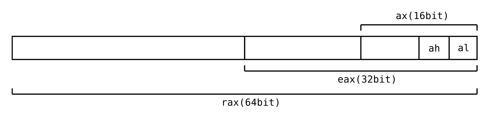

## CPUについて
- CPUは(ご存知の通り)コンピュータにおける中心的な処理装置、コンピュータの頭脳。
- CPUはレジスタという，データを保持する領域を持ち，内部の値を用いて計算を行う。
  - レジスタを用いた計算は超高速だが，レジスタはそこまで大きくない。
  - そこで，メモリ上にスタックという領域を作ってデータを配置し，計算に必要なものだけを取り出したり，レジスタ内の値をスタック上に退避させたりする。
    - メモリ上のスタックの番地(アドレス)の先頭と末尾を記憶するためのレジスタもある。
- CPUにはさまざまなアーキテクチャ(設計)がある。
  - PC, サーバーで一般的なx86
  - スマホなど，省電力デバイスで一般的なARM
  - などなど...

基本はx86を中心に扱っていく。

## x86アーキテクチャ
- x86アーキテクチャには8個の汎用レジスタ，6個のセグメントレジスタ，1個のフラグレジスタがある
- とりわけ重要な６つの汎用レジスタのみ説明する。

---

- RAX/EAX/AX/AH/AL
- RBX/EBX/BX/BH/BL
- RCX/ECX/CX/CH/CL
- RDX/EDX/DX/DH/DL
  - これら4つは一時的な値を入れる領域である。

---

- RBP/EBP/BP
  - スタックベースポインタレジスタ。メモリのスタックのそこを指し示す。
- RSP/ESP/SP
  - スタックポインターレジスタ。スタックの天井を指し示す。

---

### x86の表記と歴史
- 各レジスタで複数の表記(RAX/EAX/AX/AH/ALのような..)があることが気になった方もいると思われる。
- x86は8bit CPU時代から拡張を繰り返しており，64Bit(x86-64)が主流となった現在でも後方互換性を持つ
(32bitや，それ以前のプログラムを動かせたりする)
    - 表記が複数存在するのはその名残りであり，互換性のため，**名前ごとにレジスタの領域の指し示す場所が異なる**。(下図参照)
  

- x86-64 環境では，64bitのレジスタ幅，RAX,RBX,RCX,RDX,RBP,RSPが主に使われる。

## 参考: x86における関数の呼び出し
- x86環境で関数を呼び出すためには，引数を全て積んだ後，関数の開始アドレスへジャンプする必要がある
- x86-64環境ではレジスタ->スタックの順に積まれる

|引数|レジスタ|
|---|---|
|1|rdi|
|2|rsi|
|3|rdx|
|4|rcx|
|5|r8|
|6|r9|
|7以降|スタック|

- 引数をスタックに積む際，引数の順序と逆に積む 
  - 第7引数がスタックの一番上，最後に積まれる
- 関数の戻り値は，RAXレジスタに格納される

> 最初はとりあえず聞いているだけで大丈夫です。
> 
> この後の演習が終わったら，もう一度読むことをお勧めします。