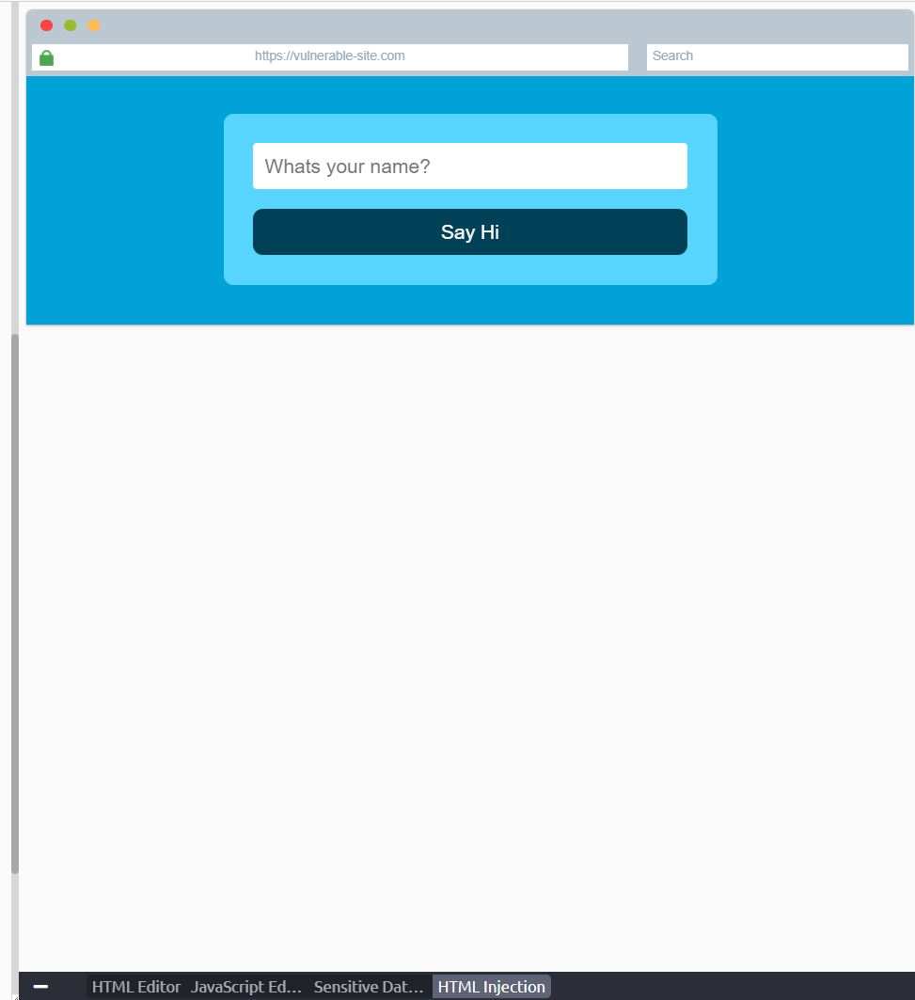
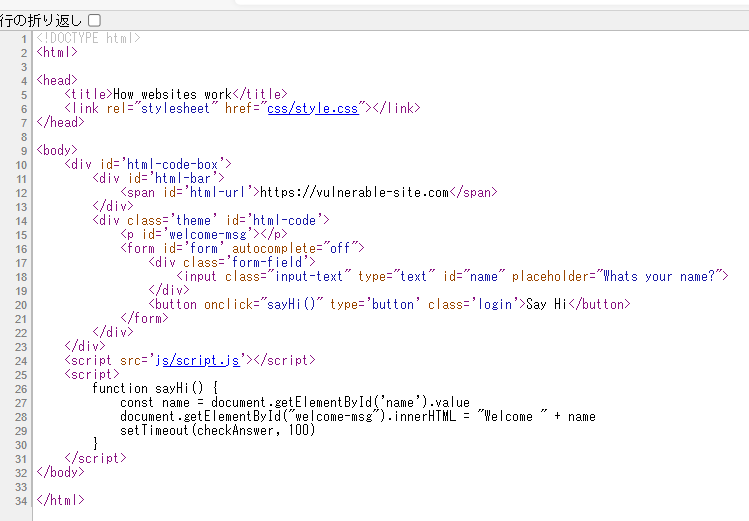

# How website work

## webサイトの仕組み

webサイトにアクセスするとブラウザ（Google,safari,fire foxなど）がアクセスしているサイトの情報を求めるリクエストをwebサーバーに送信する。

webサーバーはブラウザがページを表示するために使用するデータ（HTML,PHPなど）をレスポンスとしてブラウザに送信する。

webサーバーというのは「webシステム上で利用者の側のコンピューターに対しネットワークを通じて情報や機能を提供するコンピュータおよびソフトウェアのこと。」
<https://e-words.jp/w/Web%E3%82%B5%E3%83%BC%E3%83%90.html>

webサイトは主に二つの要素からできている

１フロントエンド（クライアント側）利用者に対する表示など他のシステムとの入出力等の外部と直接にやり取りを行う部分

２バックエンド（サーバー側）利用者や他のシステムから見えないところでデータの処理、データベースの保存等を行う部分

## HTML

HTMLとはwebサイトを構築し、webサイトの構造を決定する言語。

CSSとはwebページのスタイル（レイアウト）を指定するための言語。

Javascriptとは複雑な機能（動的にコンテンツを更新）を実装するための言語。

開始タグは要素の名前を山括弧で囲ったもの（今回はp）。どこから要素が始まっているのかを示す。
```
<p>
```

終了タグは要素の名前の前に「/」が入っていること以外開始タグと同じ。どこで要素が終わっているのかを示す。
```
</p>
```

※コンテンツというのは要素の中身

ページがHTML５ドキュメントであるという意味。異なるブラウザでもHTML５でページを解釈するというようにブラウザに指示をする。
```
<!DOCTYPE html>
```

HTMLドキュメントにおいてルート（基点）となる要素。ルート要素ともいわれる。他のすべての要素はこの要素の子孫として配置しなければならない。`<html></html>`

ページに関する情報が含まれる。
```
<head></head>
```

HTMLドキュメントの本文を定義している。この本文内のコンテンツがブラウザに表示される。
```
<body>
```

見出しを定義する。
```
<h1></h1>,<h2></h2>,<h3></h3>,<h4></h4>,<h5></h5>,<h6></h6>
```
`<h1>` は一番大きい見出し、`<h2>` は二番目に大きい見出しというように番号を大きくしていくと徐々に見出しの大きさは小さくなる

段落を定義する要素。
```
<p></p>
```

要素は他にも多くあり、画像のパスを指定するためのsrc属性
```

```
や、要素のスタイルを設定するためのclass属性
```
<p class="bold-text">
```
などがある。

任意のwebサイトのHTMLを表示するにはマウスを右クリックすると出てくる「ページのソースを表示」をクリックする。

HTMLでのコメント文のつけ方は
```
`‹<!--コメント文 -->`
```

## Javascript

Javascriptはwebページの機能を制御するために使われる。

JavascriptがHTML上に記述されるとき
```
<script>Javascript</script>
```

次のJavascriptではHTML上の "demo" というidで検索し、その要素の内容を"Hack the Planet!"に変更する。
```
document.getElementById("demo").innerHTML = "Hack the Planet";
```

ここからは上のソースコードを少し詳しく説明する
```
document はブラウザに読み込まれたwebページを指す。通常 document. のような形で連結させる。

getElementById( id ) はid属性がidである要素のElementオブジェクトを返す。なおid属性は大文字・小文字が区別される。

innerHTML はhtml要素のコンテンツを変更する。
```

## HTML injection

フィルター処理されていないユーザーの入力がページ上に存在するときに発生する脆弱性。

webサイトがユーザーが入力したもののサニタイズに失敗し、その入力がwebページ上で利用されているとき、攻撃者は悪意のあるHTMLコードをwebサイトに挿入することが出来るという脆弱性。





ソースコードから分かるように目的のHTMLコードを入力すればflagが得られる。
